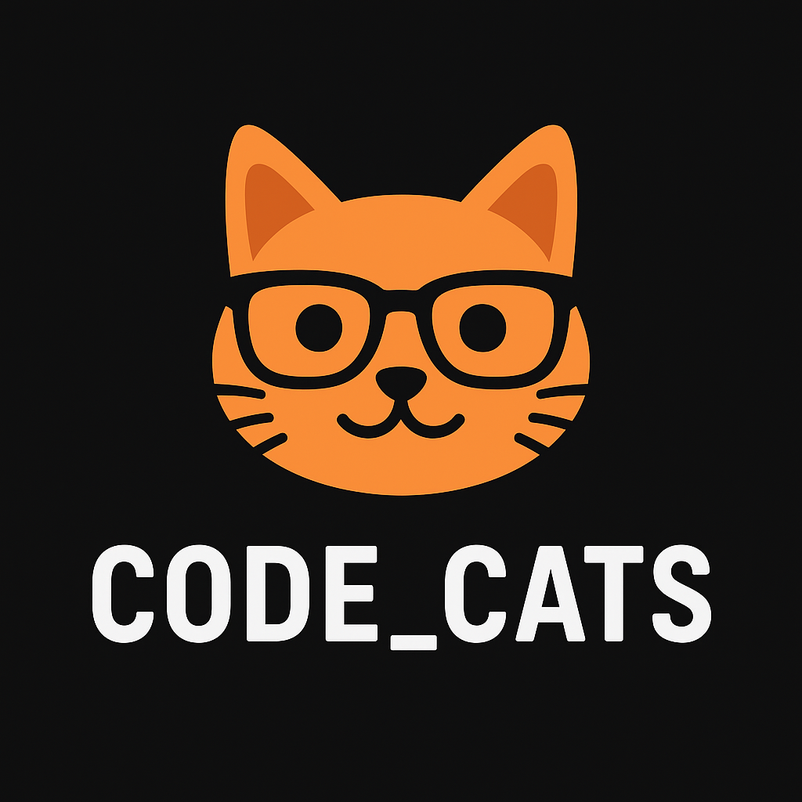
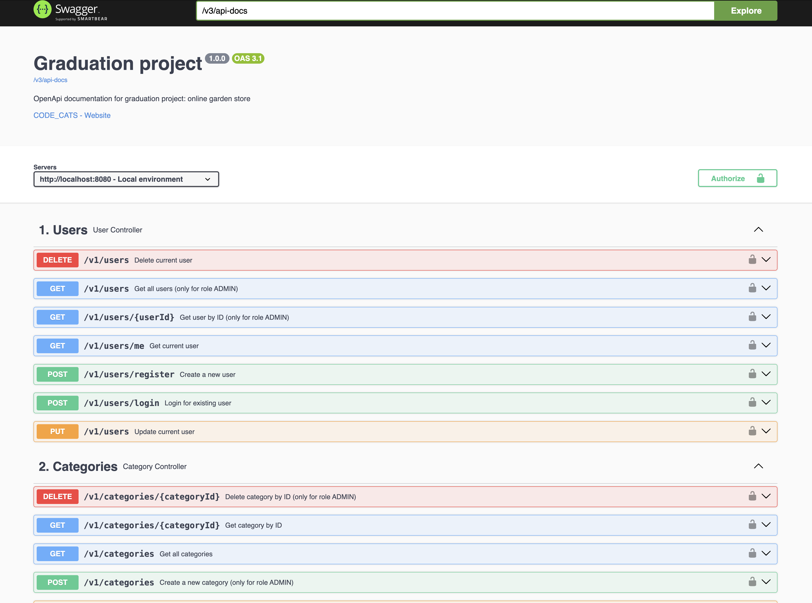

# Garden Store

_A graduation project by **CODE_CATS** team_

## About the Project

**Project Name:**  
Garden Store

**Team Name:**  

CODE_CATS

**Links:**
-  [Documentation (Project requirements)](https://docs.google.com/document/d/1Xn41eFhdYAJVYzRucsNwpbLJ5lNxdvpfx__SZf5DwXA/edit?tab=t.0)
-  [REST API Endpoints](https://confirmed-baron-2e5.notion.site/REST-API-f186cf63a46c4020b2237f73093922ab)
-  [JIRA (Backlog & Tasks)](https://natzubova.atlassian.net/jira/software/projects/GSP/boards/1)
-  [Deployed Version](http://51.20.105.119:8080/swagger-ui/index.html#/)

**Description:**  
Garden Store is an online store for gardening, where users can browse, explore, and purchase plants, gardening tools, and accessories.

## Main Page Screenshot

## Core Features
- 🌿 Product catalog with advanced filtering
- 🔍 Detailed product page with descriptions & images
- 🛒 Shopping cart and order checkout
- 🔑 User registration & authentication (Spring Security + JWT)
- 📡 REST API (CRUD for products, users, orders)
- 📝 Swagger API documentation
- ✅ Unit & integration tests

## Entities Overview
| Entity    | Description                     | Details                                    |
|-----------|---------------------------------|--------------------------------------------|
| User      | Manages user accounts           | [Users.md](src/main/docs/user.md)          |
| Category  | Groups products into categories | [Categories.md](src/main/docs/category.md) |
| Product   | Stores product details          | [Products.md](src/main/docs/product.md)    |
| Favorite  | Manages user favorite products  | [Favorites.md](src/main/docs/favorite.md)  |
| Cart      | Shopping cart with items        | [Cart.md](src/main/docs/cart.md)           |
| CartItem  | Stores cart items details       | [Cart.md](src/main/docs/cart_item.md)      |
| Order     | Customer orders and reports     | [Orders.md](src/main/docs/order.md)        |
| OrderItem | Stores order items details      | [Orders.md](src/main/docs/order_item.md)   |

## Tech Stack
| Technology            | Purpose                                       |
|-----------------------|-----------------------------------------------|
| Java 21               | Programming language                          |
| Spring Boot 3.5.3     | Application framework                         |
| Hibernate             | ORM framework                                 |
| PostgreSQL            | Database                                      |
| H2 Database           | In-memory DB for testing                      |
| ModelMapper           | Object mapping (DTO ↔ Entity)                 |
| Lombok                | Code reduction (getters, setters, builders)   |
| Liquibase             | Database versioning and migration management) |
| Spring Security + JWT | Authentication & authorization                |
| Swagger / OpenAPI     | REST API documentation                        |
| JUnit + Mockito       | Testing                                       |
| Docker                | Deployment & containerization                 |
| Git + GitHub          | Version control                               |

## Team CODE_CATS

- **Natalia Kondratenko**
    *Role:* Team Leader  
    *Contributions:*
    - Set up user management and authentication with Spring Security + JWT
    - Integrated Swagger (OpenAPI) for API documentation
    - Added Liquibase for database initialization and versioning
    - Configured ModelMapper with custom converters
    - Implemented core controllers: `OrderController`, `ReportController`, and services (e.g. `ReportService`)
    - Created unified response handling (`ApiResponse`) and global exception management
    - Implemented order status updates via Scheduler
    - Ensured code quality by adding JaCoCo test coverage reports
    - Deployed the project and managed release process

- **Alexendra Kriviz**  
  *Role:* Developer  
  *Contributions:*

- **Maria Shirokova**  
  *Role:* Developer  
  *Contributions:*

- **Dmitrij Rabtsevitch**  
  *Role:* Developer  
  *Contributions:*